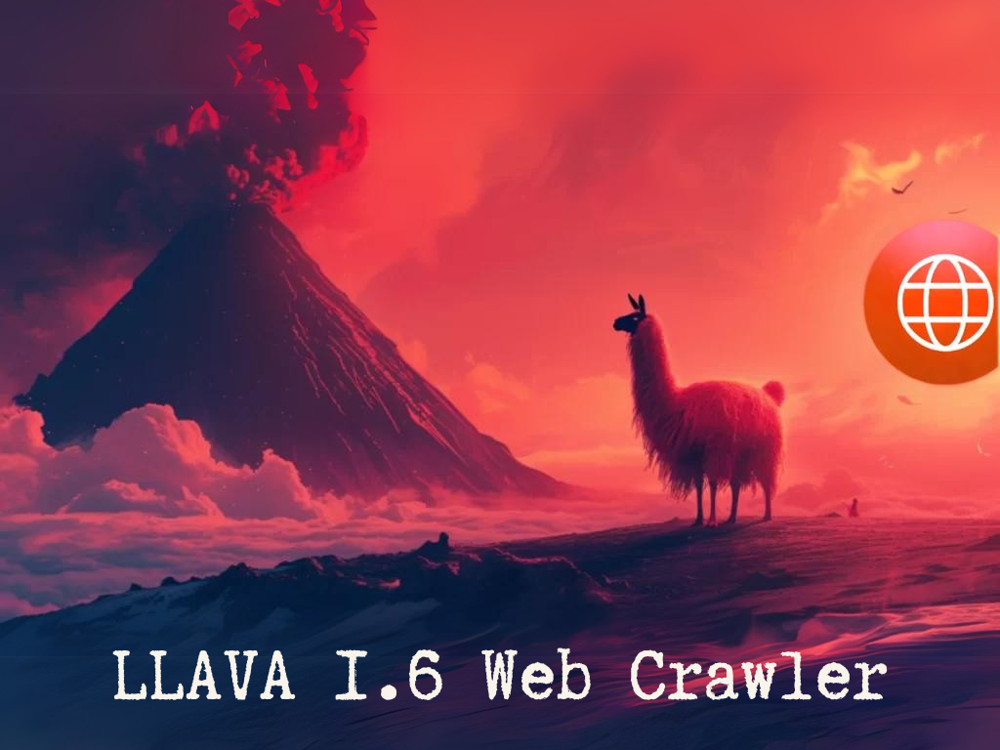

# 🦙 LLaVA Web Crawler

This repository contains a web-crawling agent powered by Puppeteer and integrated with LLaVA (Large Language and Vision Assistant) for seamless interaction with web pages, including link navigation, screenshot processing, and instruction handling.

---

## Features

- **Puppeteer-Based Crawling**: Utilizes Puppeteer with stealth plugins for undetected browser automation.
- **LLaVA Integration**: Leverages LLaVA 1.6 to process screenshots and interact intelligently with web content.
- **Highlight Links**: Automatically identifies and highlights clickable elements on a webpage.
- **Flexible Navigation**: Supports URL redirection and link-based navigation.

---
